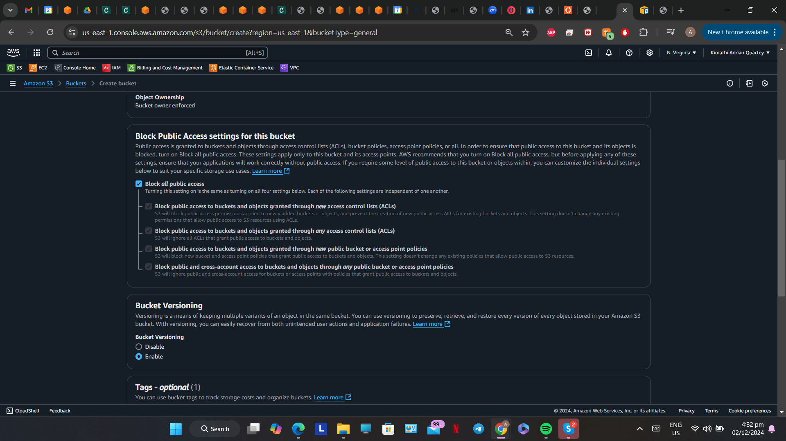
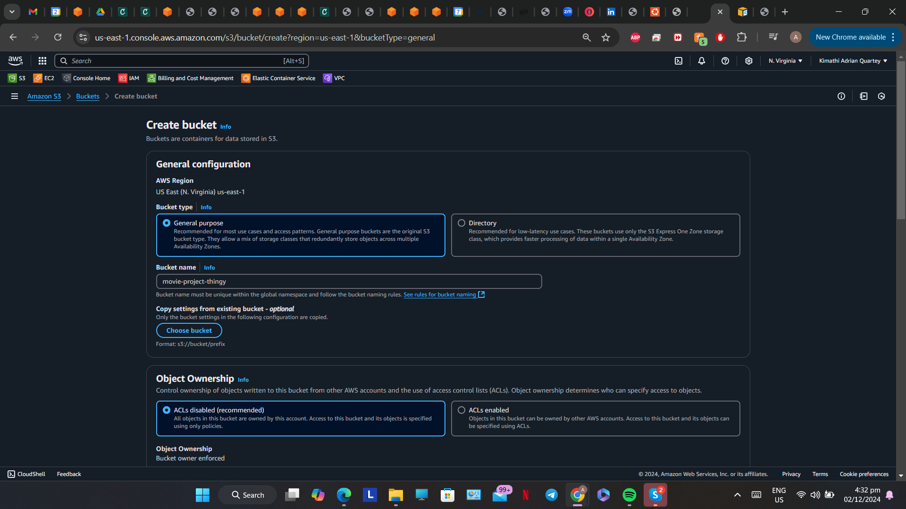
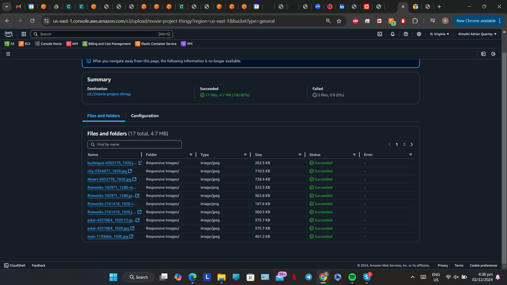
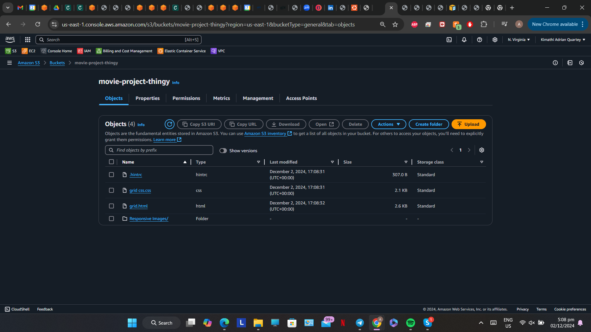
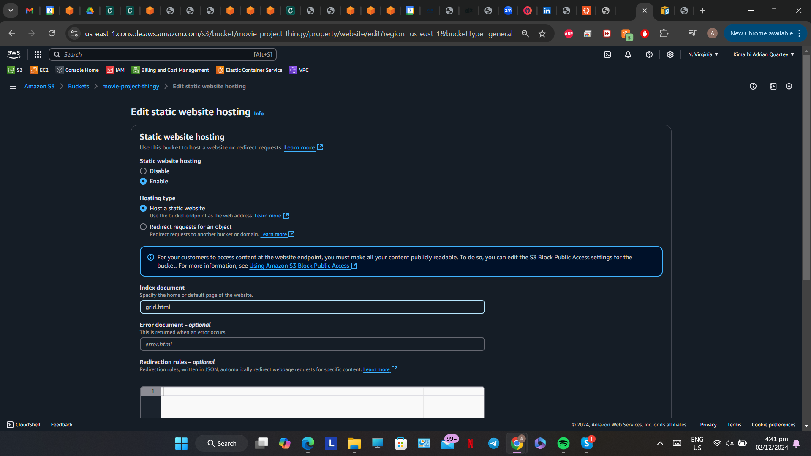
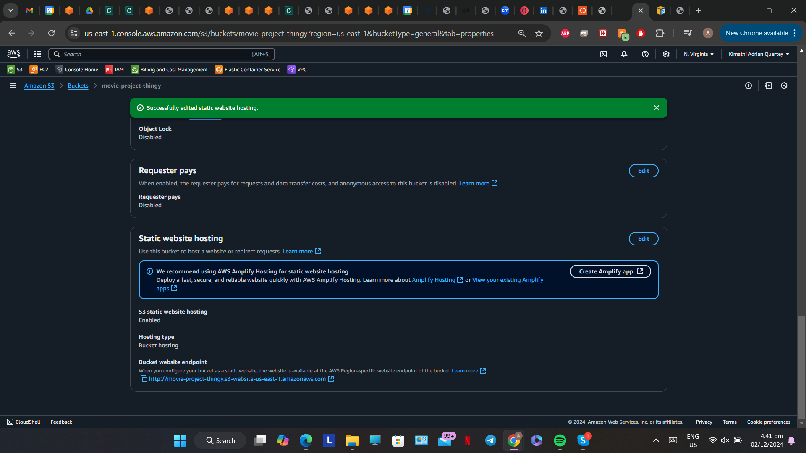
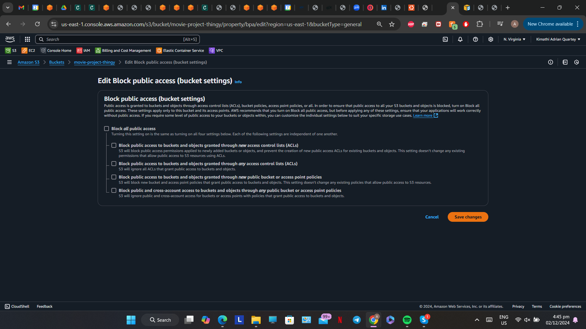
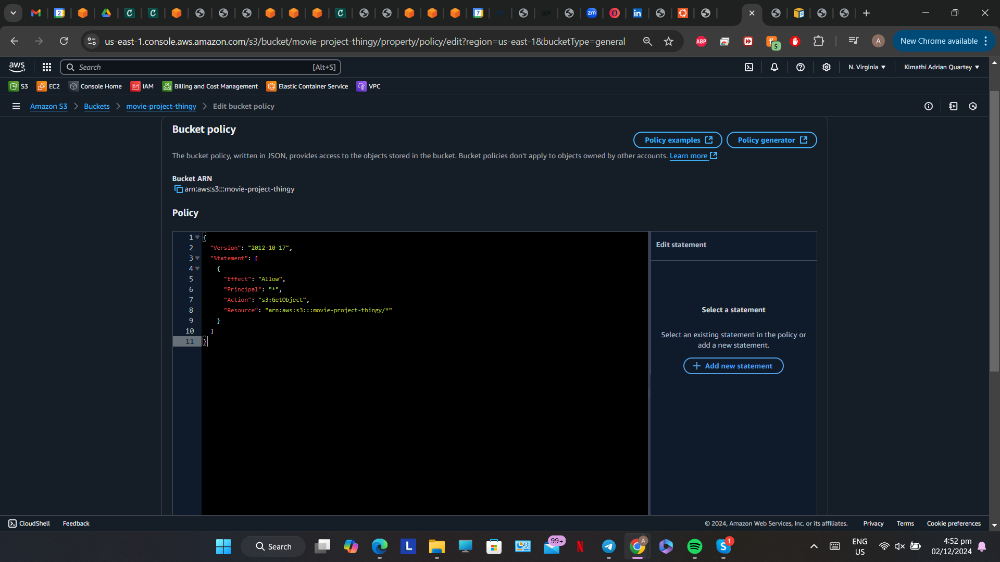
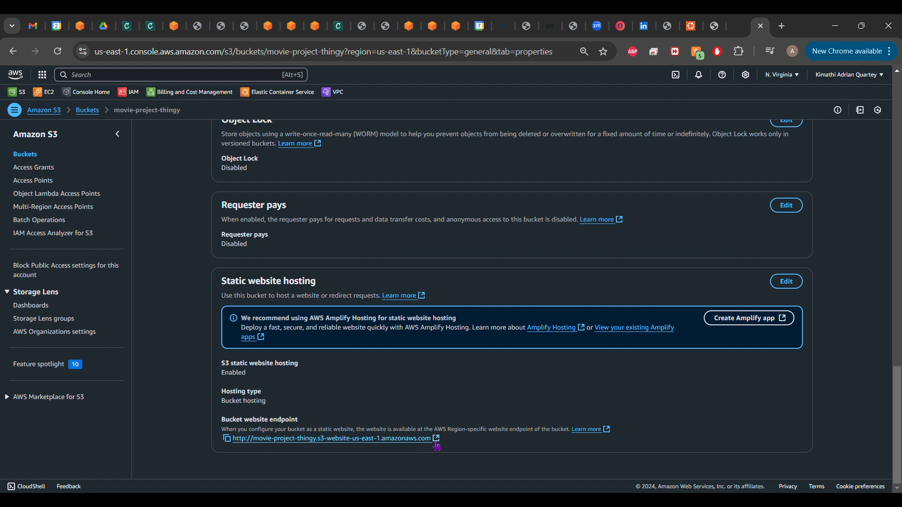
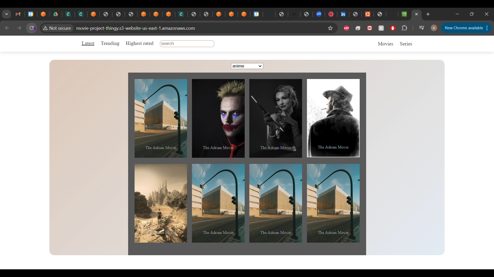

**Hosting a Static Website on AWS using S3**

Project Introduction  
In this AWS project I would be demonstrating the process of hosting a static website using the AWS service S3(Simple Storage Service).  
I feel it is a right of passage for every AWS Engineer, Developer or Solutions Architect to host a website on S3 as their first project and out of respect to this tradition I would be doing the same in this project write-up. Files i created to be used for the project would be provided in a Github Repo.

What is S3?  
AWS’s Simple Storage Service is an object storage service offered through the cloud. Meaning that unlike block storage, any changes made to a data object involves uploading an entirely new version of that object. An example scenario: Let's say I upload a css file to an S3 bucket. In this CSS file, there is a line of code that sets the background-color of an html file as yellow. In order to change the background color of the CSS file to blue, I would have to do so locally then reupload the new CSS file with this change to the S3 bucket. Due to this object storage dilemma, S3 is best used to host static websites and not dynamic ones. Other services like Amplify or Elastic beanstalk can help with that.

Services Used  
S3

The Project  
First of all we need to navigate to S3 in our AWS account and create an S3 bucket which would be the actual container of the website files. It needs a globally unique name and we would be enabling versioning on the bucket.  

In the bucket we'll upload the files and folders we need for the website.  

Under the properties tab of the bucket we need to enable Static Website Hosting and give the path to our Index document. In my case grid.html  

Next up, bucket permissions. We need to disable “Block All Public Access” which technically is a vulnerability risk to our bucket. However it would allow the contents of the bucket in this case the website to be accessible over the internet and not just to the bucket owner. It's best not to have any personal files or other objects for that matter in the bucket other than the website files.  

After this we need to write a bucket policy in json to allow the public internet access to the bucket. The principal being set to “\*” would allow every IP address access to the bucket, hence; the public internet. The resource section contains the Amazon Resource Name(arn) of the bucket being accessed by the Principal.

{  
"Version": "2012-10-17",  
"Statement": \[  
{  
"Effect": "Allow",  
"Principal": "\*",  
"Action": "s3:GetObject",  
"Resource": "arn:aws:s3:::bucket-name/\*"  
 }  
 \]  
 }  

Everything is set now to access the website through our browser. Under the properties tab we can see the website URL for our bucket. Clicking on it would open a new tab to the website.  

As you can see from the screenshot above we can finally view the website in our S3 bucket.

Some key notes on why S3 may not be the best for web hosting.

1. S3 does not natively support HTTPS, so any communication between the client browser and S3 is not secure. It also does not have support for certificates if you wanted to do so manually.
2. As discussed earlier, S3 is not suitable for dynamic website hosting as there is no processing power involved with object storage.

Future plans  
In my next project, I would be using a Content delivery Network, in this case Amazon CloudFront to serve the website. This would help mitigate the issue of bucket vulnerability by using a method called Origin Access Control(OAC). CloudFront also natively supports HTTPS so any traffic would be secure.
